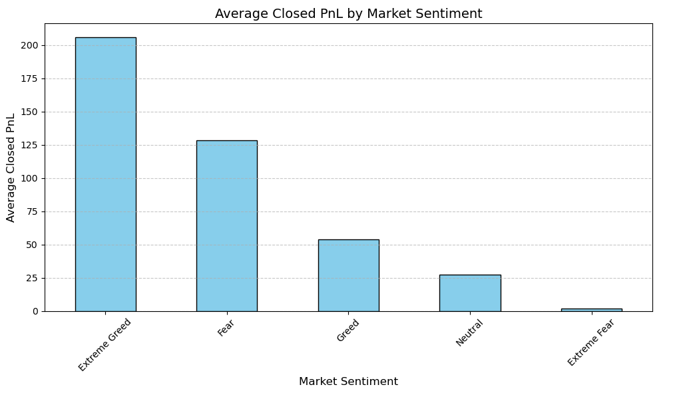
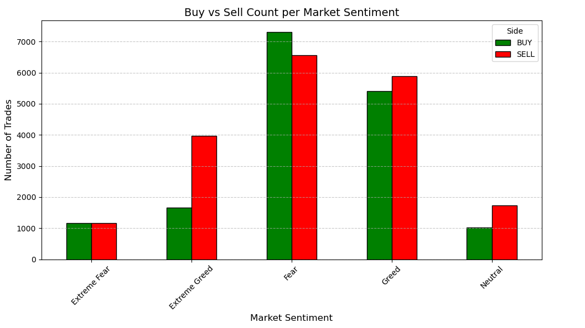
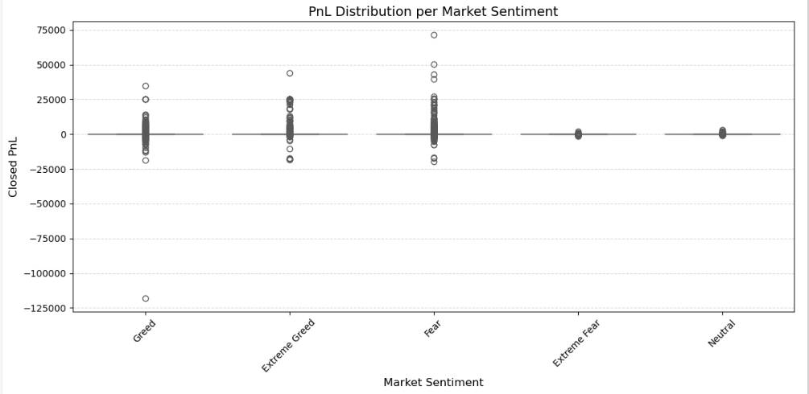
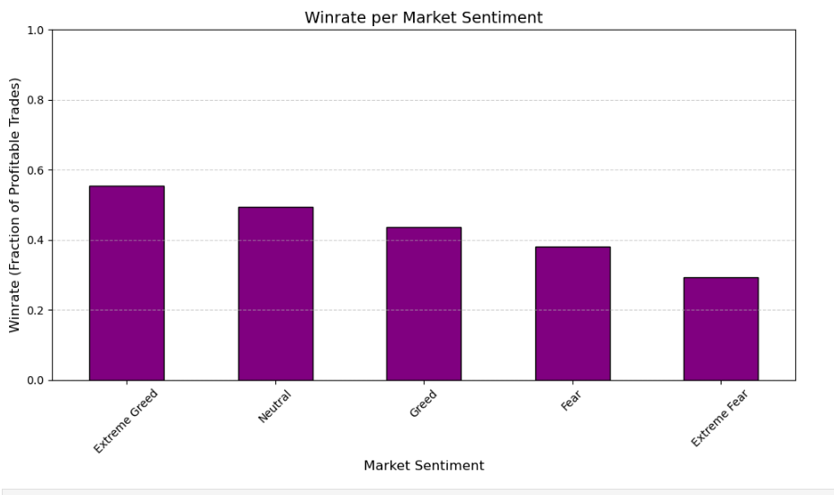

# 📈 Trader Sentiment Analysis – Linking Market Mood to Trader Behavior

This data science project explores how **market sentiment** influences **trader behavior** and **performance outcomes** on a real-world crypto trading platform. Using Python, we merged trader data with sentiment data and conducted deep analysis with Pandas, supported by essential Matplotlib and Seaborn visualizations.


## 🎯 Project Objective

To uncover the relationship between **market sentiment** and **trader performance**.


## 📁 Datasets Used

1. **Fear & Greed Index**  
   - Columns: `date`, `classification`  
   - Values like: Fear, Greed, Neutral, etc.

2. **Historical Trader Data (Hyperliquid Exchange)**  
   - Columns include:  
     `Timestamp IST`, `Side`, `Execution Price`, `Fee`, `Closed PnL`  
   - Time-stamped logs of every trade made on the platform

---

## ⚙️ Project Workflow

```python
# Step 1: Load CSVs
fear_greed = pd.read_csv("fear_greed_index.csv")
historical_data = pd.read_csv("historical_data.csv")

# Step 2: Clean & Select Required Columns
fear_greed = fear_greed[["date", "classification"]]
historical_data = historical_data[["Timestamp IST", "Closed PnL", "Side", "Execution Price", "Fee"]]

# Step 3: Format Date Columns
fear_greed["date"] = pd.to_datetime(fear_greed["date"]).dt.date
historical_data["Timestamp IST"] = pd.to_datetime(historical_data["Timestamp IST"], errors="coerce")
historical_data["date"] = historical_data["Timestamp IST"].dt.date

# Step 4: Merge DataFrames on Date
merged_df = pd.merge(historical_data, fear_greed, on="date", how="left")

```
#
## 📊 Key Analysis

#### ✅ Average Profit/Loss `(PnL)` according to market sentiment
    
- To determine how trader profitability varies with market mood, the `mean Closed PnL` for each sentiment (Fear/Greed) was calculated.

#### ✅ Distribution of Trade Volume `(Buy/Sell) by Sentiment`
    
- To find trends in behavior, the quantity of buy and sell trades under each sentiment was examined.

#### ✅ Comparing `Fees` by Trade Side (buy vs. sell) and Sentiment

- highlighted cost effectiveness and behavior by comparing the average fee paid under various trade sides (buy vs. sell) and sentiments.

#### ✅ Risk by Sentiment (Standard Deviation) 
    
- To understand risk under Fear and Greed, I looked at how much profits variate with different sentiments.

#### ✅ PnL Descriptive Statistics

- An overview of the profit distribution was provided by the summary statistics (Min, Max, Mean, 25th, 50th, and 75th percentiles) of Closed PnL that were generated using `describe()`.


#
## 📈 Visualizations

We used basic `matplotlib` and some `seaborn` for cleaner styling.

### 📊 Bar plot: Avg PnL per sentiment


### 📊 Bar plot: Trade volume by sentiment


### 📊 Comparison: Fee for Buy vs Sell


### 📊 Distribution of PnL using `describe()` and quartiles


#
## 🔍 Key Findings
#### Traders did better when the market felt Greedy.

On average, profits were higher during Greed days. It looks like when the market is confident, traders take more advantage and earn more.

#### People tend to Buy when it’s Greed, and Sell when it’s Fear.

The trade volume clearly shifted — traders were more comfortable buying during Greed, while during Fear, they sold more. Makes sense emotionally too.

#### Profits during Greed had more ups and downs.

The boxplot showed that Greed comes with more risk — profits ranged widely. Some traders made a lot, some didn’t. But in Fear, results were more steady (but lower).

#### Winning trades happened more often during Greed.

The win rate (percentage of positive PnL trades) was clearly better during Greed. So not only were profits higher, but traders also won more often.
